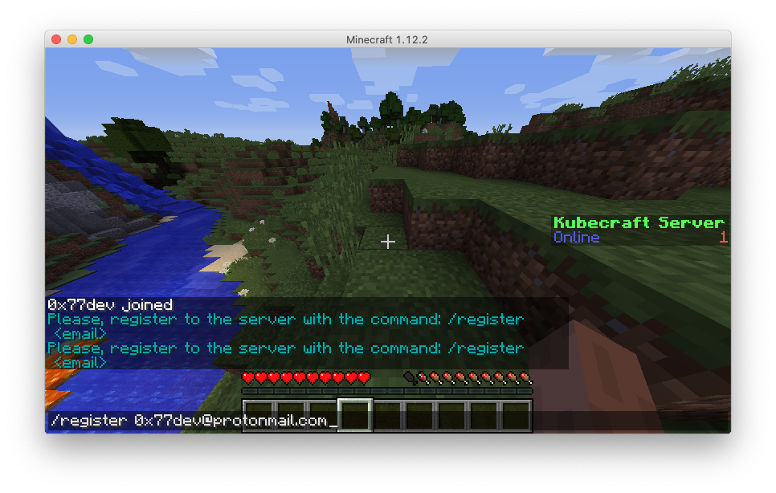
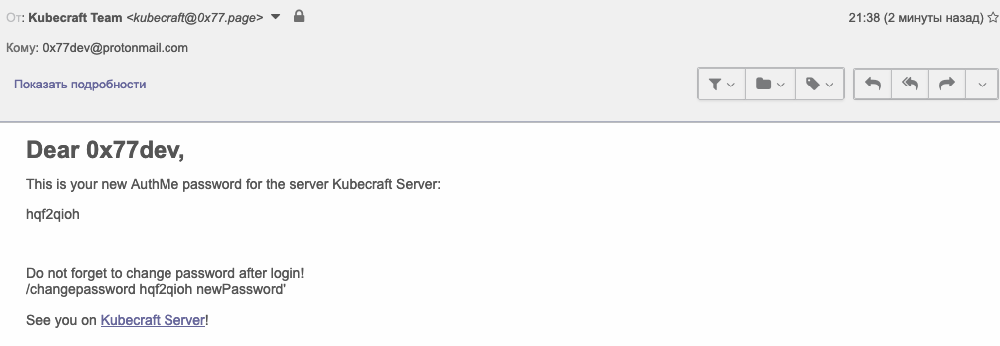
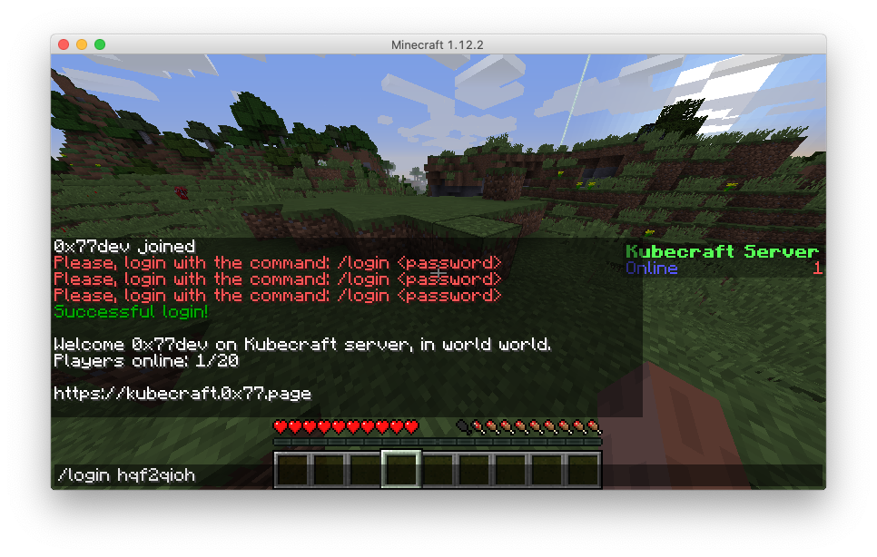

# Authorization

## Register

After joining the server

Enter this command: `/register <email>`

After that you will receive email with your password like that one:

## Login

You can login using this command: `/login <password>`

## Change your password

Then you can change your password using this command: `/changepassword <oldPassword> <newPassword>`

